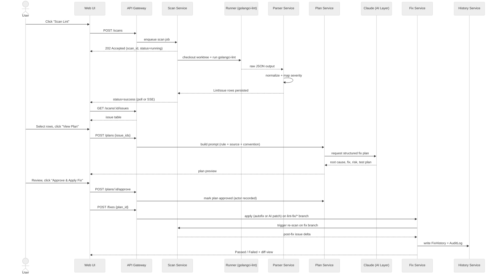
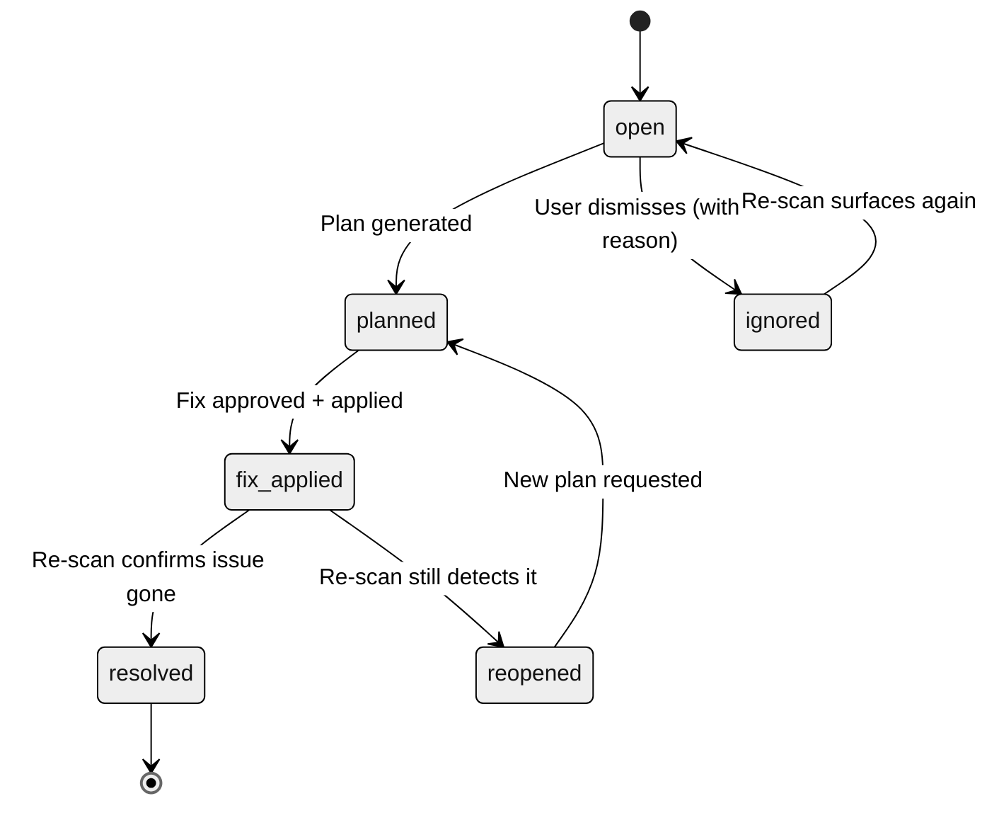

# 03 — Proposed Workflow

**Date:** 2026-08-03
**Status:** Draft — sourced verbatim from the Architecture Design Artifact's Workflow section
**Source:** `golangci/golangci-lint-dashboard.html` §Workflow, `golangci/dashboard.md` (steps 1-9)
**Dependency:** [02-current-workflow.md](02-current-workflow.md) (delta), [01-business-requirement.md](01-business-requirement.md) (goal alignment)

## User Journey

1. User opens the Web UI (Dashboard screen — see [05-ui-design.md](05-ui-design.md)).
2. User clicks **Scan Lint** → `POST /scans` (see [06-api-design.md](06-api-design.md)) enqueues a job; API returns `202 Accepted` immediately — the scan runs on a Worker, not inside the request.
3. Scan Service checks out an isolated git worktree, runs `golangci-lint run --out-format json`, and Parser Service normalizes the output into `LintIssue` rows (severity-mapped, fingerprinted).
4. Issue List screen shows results in a filterable, checkbox-selectable table.
5. User selects one or more rows and clicks **View Plan** → `POST /plans {issue_ids}` — Plan Service builds a prompt (rule + source context + repo conventions) and calls Claude (AI Layer) for a structured Fix Plan (Root Cause, Current Behavior, Recommended Fix, Risk, Breaking Change, Files Impacted, Test Plan).
6. User reviews the plan in the Plan Viewer screen and clicks **Approve & Apply Fix** → `POST /plans/:id/approve` (records the approving actor) then `POST /fixes {plan_id}`.
7. Fix Service applies the fix (native `--fix` where autofixable, else the AI-authored patch) on a `lint-fix/*` branch only, then automatically triggers a re-scan.
8. Fix Progress screen shows Queued → Applying → Re-scanning → Passed/Failed, with a diff view.
9. History screen persists Scan History, Applied Fixes, and Rollback History as separate audit tabs — a capability the current CLI flow (see [02-current-workflow.md](02-current-workflow.md)) does not have at all today.

## Sequence Diagram — Scan Lint → Apply Fix

## State Machine — Issue Lifecycle

## Actors & Roles

| Role | Journey touchpoint |
|---|---|
| `viewer` | Steps 1-4, 8-9 (read-only: scan status, issue list, history) |
| `approver` | Step 6 (approval gate) |
| `operator` | Steps 2, 7 (trigger scan, apply fix, rollback) |
| `admin` | Configuration (severity mapping, model config) — outside the main journey |

Full role-to-endpoint enforcement is defined in [06-api-design.md](06-api-design.md); role-to-security-control mapping is defined in [12-component-design.md](12-component-design.md).

## Delta vs current workflow

| Current (CLI) | Proposed (Web UI) |
|---|---|
| Manual `make lint`, read static report file | `POST /scans`, async job, live issue table |
| Rule-based template plan (`lint-fixed-plan.sh` hardcoded per linter) | AI-generated plan (Claude, contextual) |
| One issue at a time (`N=<num>`) | Batch selection, multiple `issue_ids` per plan request |
| Manual code edit, no approval gate | Explicit `approve` step before Fix Service will act |
| No persistent history | Scan/Fix/Rollback history, all persisted and browsable |
