# 07 — Database Design

**Date:** 2026-08-03
**Status:** Draft — ER diagram and field tables sourced verbatim
**Source:** `golangci/golangci-lint-dashboard.html` §Database Design
**Dependency:** [04-prd.md](04-prd.md) (FR→data need), [03-proposed-workflow.md](03-proposed-workflow.md) (state→status field)

## Design rationale (why these decisions)

golangci-lint's native JSON output leaves `Severity` blank unless a config maps it — so severity mapping lives in the `Configuration` entity (below), following this repo's `root_cause_mappings.json` config-driven pattern (`AGENTS.md` §Conventions).

## Entity Relationship Diagram

```mermaid
%%{init: {'theme':'neutral'}}%%
erDiagram
  LintScan ||--o{ LintIssue : contains
  LintIssue }o--o{ FixPlan : "planned via (junction)"
  FixPlan ||--o{ FixHistory : "applied as"
  FixHistory ||--o{ RollbackHistory : "reverted by"
  Configuration ||--o{ LintScan : "scopes"

  LintScan {
    string id PK
    string repo_ref
    string branch
    string commit_sha
    string triggered_by
    string status
    string config_hash
    string raw_output_ref
  }
  LintIssue {
    string id PK
    string scan_id FK
    string file_path
    int line
    int column
    string linter
    string rule
    string message
    string severity
    string fingerprint
    string status
  }
  FixPlan {
    string id PK
    string root_cause
    string current_behavior
    string recommended_fix
    string risk_level
    bool breaking_change
    json files_impacted
    json test_plan
    string status
    string generated_by
    string batch_fingerprint
    string prompt_version
  }
  FixHistory {
    string id PK
    string plan_id FK
    string applied_by
    string branch_name
    string diff_ref
    string pre_fix_scan_id
    string post_fix_scan_id
    string result
  }
  RollbackHistory {
    string id PK
    string fix_history_id FK
    string rolled_back_by
    string revert_commit_sha
    string post_rollback_scan_id
    string reason
  }
  Configuration {
    string id PK
    string key
    json value
    string scope
  }
```

## Entity Field Tables

Field types and keys are as shown in the diagram above (not duplicated as separate tables here, per this suite's no-duplication rule — see [plans-structure-analysis.md §1.2](../plans-structure-analysis.md)).

## Notable fields / design rationale

| Field | Rationale |
|---|---|
| `LintIssue.fingerprint` | `hash(file_path + rule + normalized_message)` — tracks whether an issue is the same one across scans even if its line number shifts |
| `FixPlan` ↔ `LintIssue` junction table | Lets one plan handle a batch of issues (e.g. 3 issues in the same file) rather than one plan per issue |
| `Configuration.scope` | `global` (default severity map, model choice) vs `repo` (repo-specific golangci-lint config path, permission override) |
| Stack choice | Reuses this org's existing GORM + MySQL stack and `git.frontiir.net/sa-dev/rtdatacore` pattern — confirmed constraint, see [01-business-requirement.md §Constraints](01-business-requirement.md) |

## Cardinalities (explicit)

- `LintScan ||--o{ LintIssue` — one scan contains many issues
- `LintIssue }o--o{ FixPlan` — many-to-many via junction (a plan can batch several issues; an issue could theoretically appear in more than one plan attempt)
- `FixPlan ||--o{ FixHistory` — one plan can be applied (attempted) more than once
- `FixHistory ||--o{ RollbackHistory` — one applied fix can be rolled back, with a history of rollback attempts
- `Configuration ||--o{ LintScan` — one configuration scopes many scans

No enum value lists (e.g. exact allowed values for `LintIssue.severity`, `LintIssue.status`, `FixPlan.risk_level`, `FixHistory.result`) are given in the source artifact — these are deferred to [08-validation-rules.md](08-validation-rules.md), which is explicitly flagged there as net-new content.

## M3 schema additions (found by implementation, not in the original artifact)

- `LintIssue.message` — golangci-lint's issue text (minus the rule prefix); needed so `planner/` can tell the AI *what* an issue says, not just its rule name.
- `FixPlan.current_behavior` — one of the 7 fields `04-prd.md` FR-4 and `05-ui-design.md`'s Plan Viewer require; missing from the artifact's own ER diagram.
- `FixPlan.batch_fingerprint` / `FixPlan.prompt_version` — implement the Risk register's own mitigation text ("cache plan by issue+source fingerprint; store model + prompt version on FixPlan") which named these without adding the fields.
- `FixPlan.status` enum extended to `generating|pending|approved|rejected|applied|failed` (was `pending|approved|rejected|applied` in [08-validation-rules.md](08-validation-rules.md)) — an async plan-generation sub-state was implied by `06-api-design.md`'s "poll plan generation status" but never actually enumerated.

All four are additive `AutoMigrate` changes — see `golangci/plans/2026-08-04-golangci-m3-implementation.md`.
