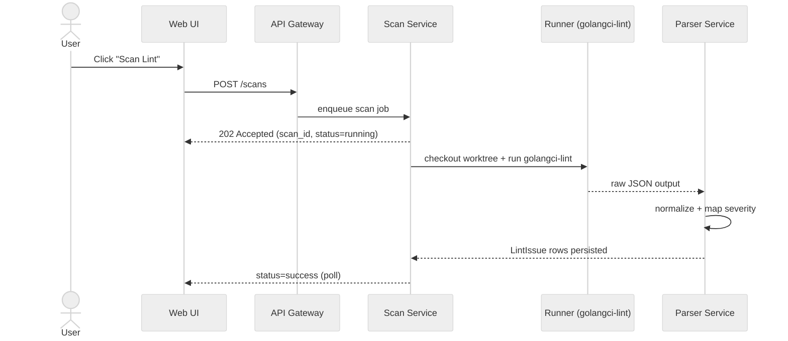
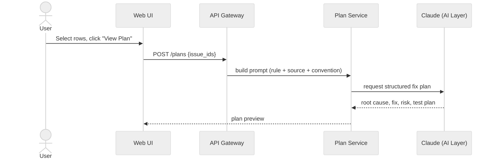
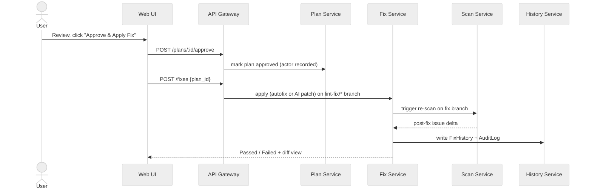
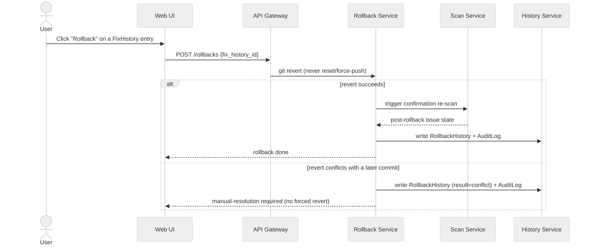

# 11 — Sequence Diagrams (per-flow, fine-grained)

**Date:** 2026-08-03
**Status:** Draft — diagrams 1–3 decompose the single combined diagram already in [03](03-proposed-workflow.md) into per-flow views; diagram 4 (Rollback) is **net-new**, no rollback sequence exists in the source artifact
**Source:** `golangci/golangci-lint-dashboard.html` §Workflow (decomposed), §Component Responsibilities (Rollback Service description, for diagram 4)
**Dependency:** [03-proposed-workflow.md](03-proposed-workflow.md) (journey), [06-api-design.md](06-api-design.md) (endpoints), [07-database-design.md](07-database-design.md) (DB writes)

[03-proposed-workflow.md](03-proposed-workflow.md) has the single end-to-end diagram; this file splits it by flow and adds the explicit sync/async boundary each flow crosses, per Phase 2's intent for this file (finer-grained than 03, ahead of [12-component-design.md](12-component-design.md)).

## Flow 1 — Scan

**Sync/async boundary**: `POST /scans` returns `202 Accepted` immediately; the actual `golangci-lint` run happens on a worker, off the request path. Client polls `GET /scans/:id` for completion.

## Flow 2 — Plan generation

**Sync/async boundary — Decided (default, 2026-08-04)**: `POST /plans` returns `202 Accepted` immediately, same as Flow 1 — an AI call has non-trivial, variable latency, so it gets the same async treatment for consistency. The UI polls `GET /plans/:id`.

## Flow 3 — Approve & Apply

**Sync/async boundary**: approval (`POST /plans/:id/approve`) is synchronous — it only flips a status field. Apply (`POST /fixes`) triggers work on a worker (git operations + re-scan), analogous to Flow 1's async boundary.

## Flow 4 — Rollback (`[net-new]`)

No rollback sequence diagram exists anywhere in the source artifact. This flow is derived from the Rollback Service's stated responsibility ([12-component-design.md](12-component-design.md): "Reverts a `FixHistory` entry via `git revert`, triggers confirmation rescan") and Business Rule BR-4 ([10-business-rules.md](10-business-rules.md): revert-only, never reset/force-push).

**Decided (default, 2026-08-04)**: `POST /rollbacks` returns `202 Accepted`, same as the other three flows — it involves a git operation plus a confirmation rescan, which is not instant.
